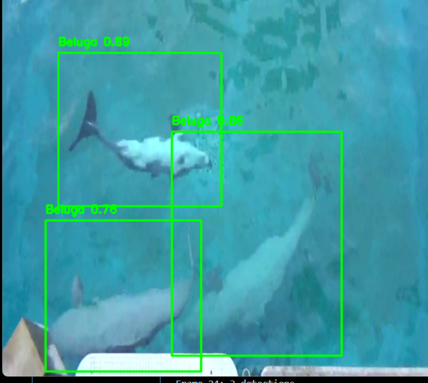

# 🐋 AI-Based Beluga Whale Behavior Tracking

This project uses YOLOv8 and OpenCV to detect and track beluga whale behavior from video footage. Built as part of a research internship at St. Mary’s University.

## 🚀 Features
- Detects multiple belugas using YOLOv8
- Tracks positions frame-by-frame
- Exports data for behavioral analysis using pandas

## 🛠 Tech Stack
- Python
- YOLOv8 (Ultralytics)
- OpenCV
- pandas
- Roboflow (for dataset labeling)

## 📸 Sample Detection




## 📦 Installation

```bash
pip install -r requirements.txt
